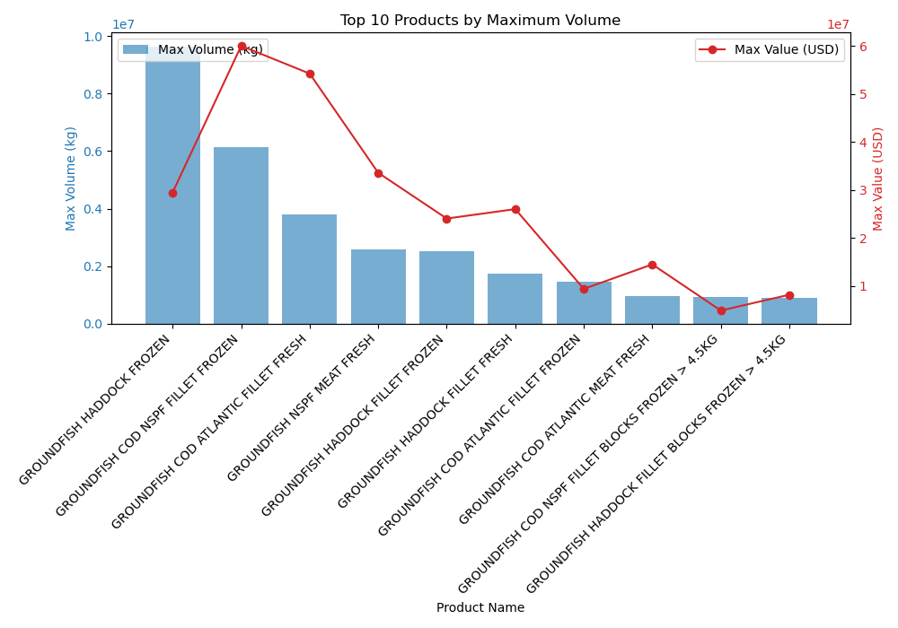

# EDA


```
make landings
```
Maine groundfish market by year:


New England groundfish market by year:


```
make north_atlantic
```


Maximum Volume (kg): Represented by the blue bars, this indicates the heaviest single shipment of a product in that year. The volume shows fluctuations over the years, with some years seeing significantly higher maximum volumes than others. There isn't a clear trend in volume; it varies from year to year without a consistent increase or decrease.

Maximum Value (USD): Illustrated by the red line with markers, this reflects the most valuable single shipment of a product for each year. Unlike the volume, the value shows a generally increasing trend over the years, suggesting that either the products are becoming more valuable, costs are increasing, or perhaps more expensive products are being shipped.


The blue bars represent the maximum volume of products imported from each of these top 10 countries in kilograms. This gives an insight into which countries are major suppliers in terms of the sheer weight of goods.

The red line with markers indicates the maximum value in USD of products imported from each country. This highlights the countries from which the most valuable shipments originate, in terms of monetary value.



Volume (kg): Represented by blue bars, this indicates which of the top 10 products are imported in the largest quantities. The length of each bar signifies the maximum volume for each product category.

Value (USD): The red markers show the maximum import value of these top products. The position of each marker provides insight into the economic value associated with the maximum shipment volume of each product.
